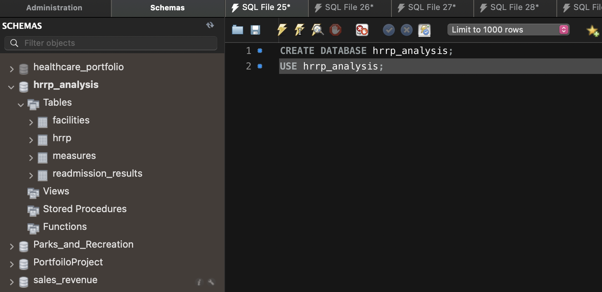
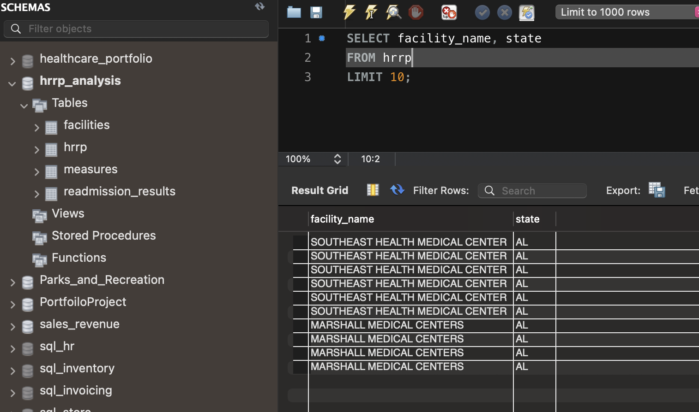
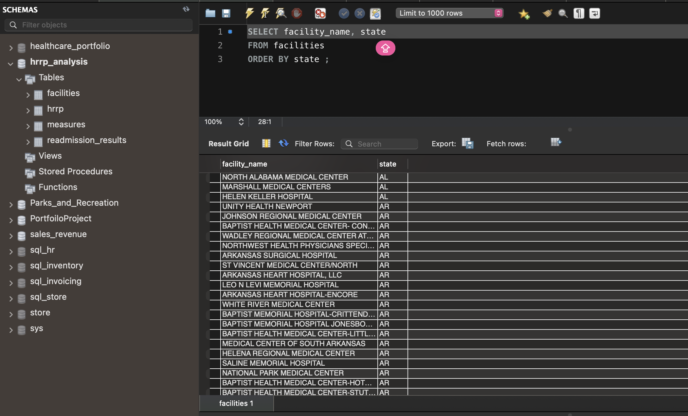
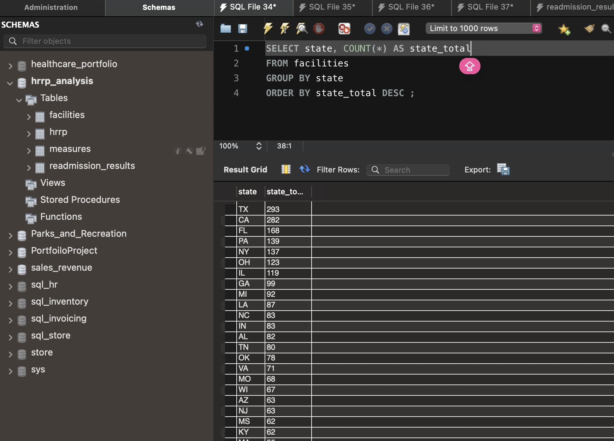
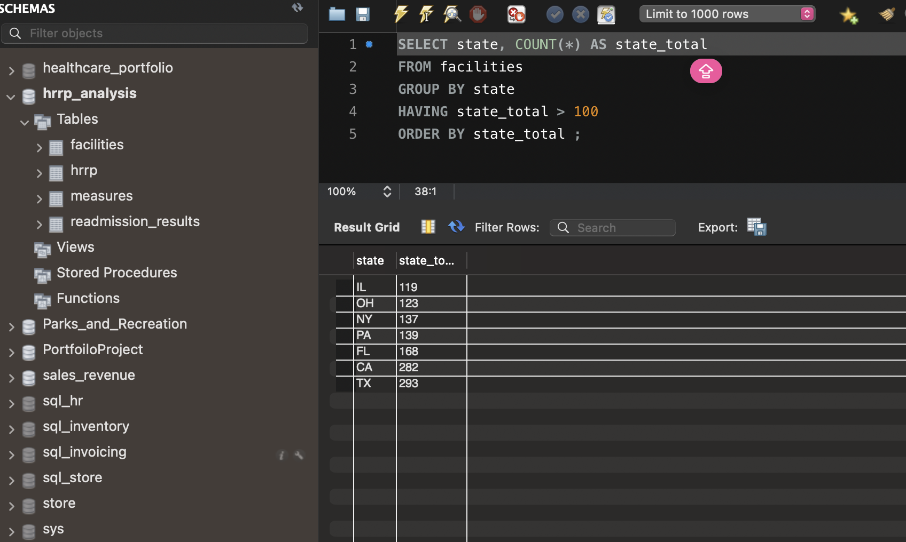
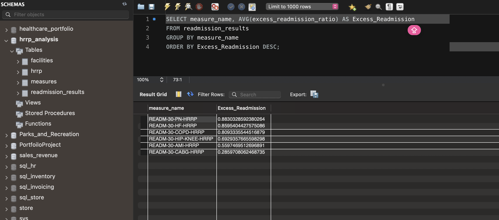
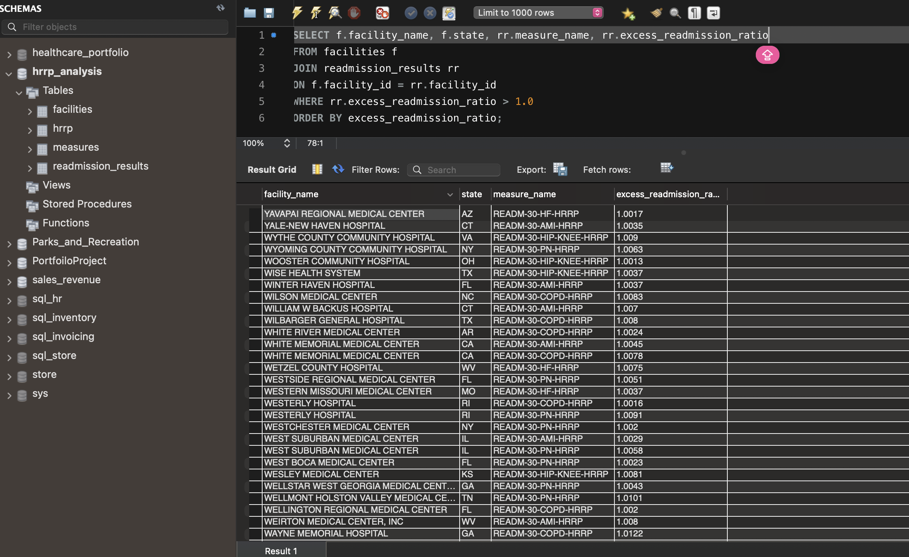

# HRRP Hospital Readmissions Analysis

## Overview
This project uses SQL to explore hospital readmissions data from the Centers for Medicare & Medicaid Services (CMS) Hospital Readmissions Reduction Program (HRRP).

The project organizes raw hospital readmissions data into separate tables and answers questions about hospital locations, state-level hospital counts, readmission measures, and excess readmission ratios.

## Purpose
The purpose of this project is to demonstrate foundational SQL skills using a healthcare dataset. The analysis includes database creation, table creation, data normalization, filtering, aggregation, grouping, sorting, and joins.

## Tools Used
- MySQL
- SQL
- CMS Hospital Readmissions Reduction Program data

## Database Structure
The project starts with a raw import table named `hrrp`. The data is then organized into three tables:

- `facilities` — facility ID, facility name, and state
- `measures` — unique readmission measure names
- `readmission_results` — readmission results for each facility and measure

## Analysis Questions
1. What facilities are included in the dataset, listed by state?
2. How many hospitals are represented in each state?
3. Which states have more than 100 hospitals in the dataset?
4. What is the average excess readmission ratio for each condition?
5. Which hospital-condition results have an excess readmission ratio above 1.0?

## SQL Skills Demonstrated
- CREATE DATABASE and USE
- CREATE TABLE
- SELECT DISTINCT
- GROUP BY
- HAVING
- COUNT() and AVG()
- ORDER BY
- JOIN
- WHERE filtering

## Author
Naterria Horton-Davis  
Master of Health Information Management — Data Analytics & Informatics

## Project Screenshots

### Database and Normalized Tables
The `hrrp_analysis` database includes the raw HRRP table and normalized tables for facilities, measures, and readmission results.

### Raw HRRP Data Preview
This query previews records from the raw HRRP table after importing the CMS data.

### Query 1: Facilities by State
This query lists hospital facilities alphabetically by state.

### Query 2: Hospital Count by State
This query counts the number of hospitals represented in each state. Texas had the highest count in this dataset, followed by California and Florida.

### Query 3: States With More Than 100 Hospitals
This query filters for states with more than 100 hospitals in the dataset.

### Query 4: Average Excess Readmission Ratio by Condition
This query calculates the average excess readmission ratio for each HRRP readmission measure.

### Query 5: Hospitals With Excess Readmission Ratios Above 1.0
This query joins the facilities and readmission results tables to identify hospital-condition results with an excess readmission ratio above 1.0.

